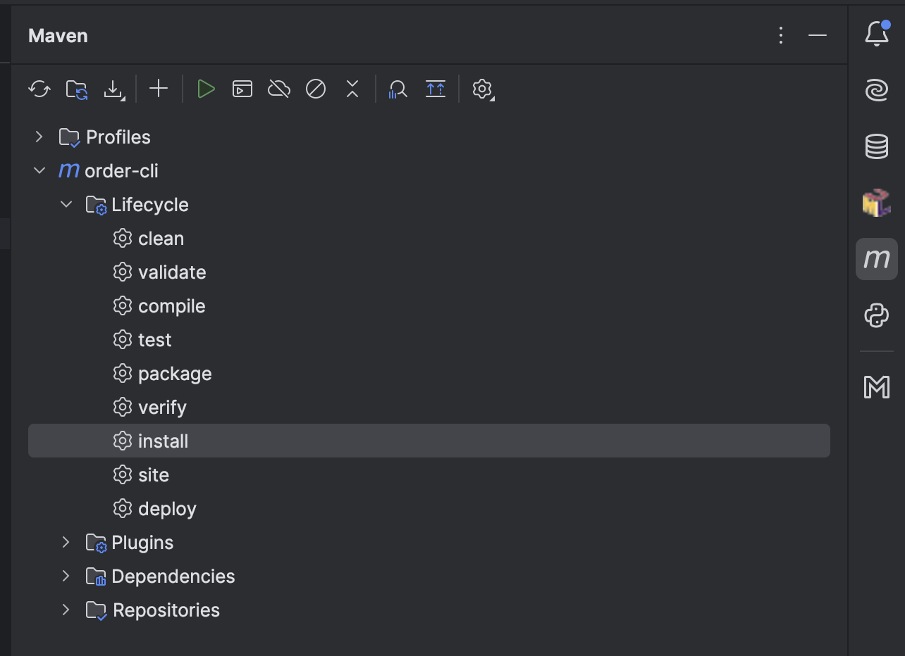

# Bem-vindo ao incrível CLI para criar pedidos

Este sistema está sendo construído durante as aulas das turmas de segurança e auditoria de sistemas.

# Pré-Requisitos
O que você precisará para rodar o projeto?
- Java 17
- IntelliJ IDEA

# Stack
O que esta sendo utilizado neste projeto?
- Linguagem: Java na sua versão 17
- Framework: Spring Shell
- Build e Dependências: Maven
- Banco de Dados: PostgreSQL

# Primeiros Passos

## Abrindo o projeto
- Baixe o projeto do github e abra-o em no IntelliJ

## Baixando as dependências
- Para compilar e baixar as dependências vocês têm duas alternativas no IntelliJ:
  - Via Interface:
    - No canto superior direito você verá um ícone com a letra M (de maven). Ao clicar nele você verá algo como na imagem abaixo, se não vier totalmente expandido basta clicar nas opções até visualizar igualmente.
      
  - Via linha de comando:
    - Abra o terminal do IntelliJ e rode ou o **mvnw.cmd** (se for usuário Windows) ou **./mvnw** (se for usuário Unix)
> NOTA: É de extrema importância executar o passo acima com sucesso pelo menos uma vez, para termos todas as dependências baixadas em sua máquina, e toda vez que uma nova for adicionada.

## Rodando o projeto
- Com as dependências devidamente baixadas:
  - Acesse a classe **Application** (ela está dentro das pastas **src** ou se preferir tecle shift duas vezes e busque a classe na tela de busca que se abrirá)